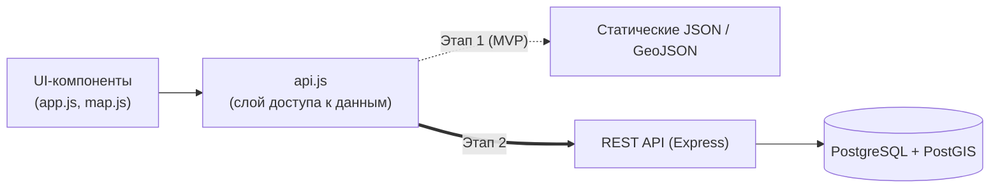
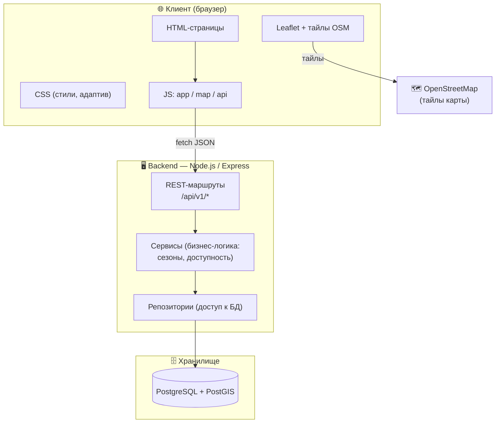
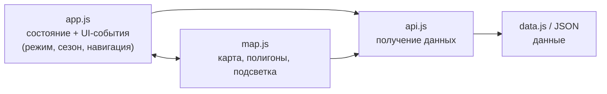
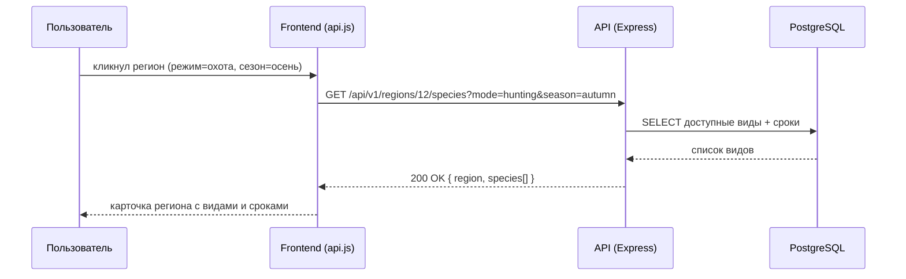
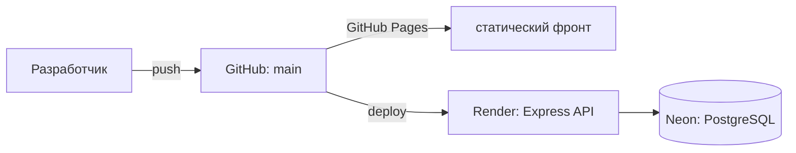

# Архитектура системы — Крепкая Охота

> Задача разработчика №2. Описывает фронтенд, бэкенд, базу данных и API, а также
> обоснование каждого решения. Диаграммы — в формате Mermaid (рендерятся на
> GitHub автоматически).

---

## 1. Принцип: два этапа

Проект делается в учебной практике, стек команды — **HTML/CSS/JS**. Поэтому
архитектура спроектирована в два этапа, чтобы MVP можно было показать уже
сегодня, а полноценный backend подключить позже **без переписывания фронта**.

| | Этап 1 — MVP (сейчас) | Этап 2 — полноценная версия |
|---|---|---|
| Frontend | HTML/CSS/Vanilla JS + Leaflet | то же |
| Источник данных | статические JSON/GeoJSON | REST API |
| Backend | нет | Node.js + Express |
| БД | нет (данные в файлах) | PostgreSQL + PostGIS |
| Хостинг | GitHub Pages / любой static | static front + сервер API |

**Ключевое решение:** между UI и данными есть слой `api.js`. На MVP он отдаёт
данные из локальных файлов, на этапе 2 — ходит в реальный API. UI при этом не
меняется.



---

## 2. Общая схема (целевая, этап 2)



---

## 3. Frontend

**Технологии:** HTML5, CSS3, Vanilla JavaScript (ES6 modules), [Leaflet.js](https://leafletjs.com/).

**Почему так:**

- **Vanilla JS, без фреймворка** — это решение команды (стек HTML/CSS/JS).
  Плюсы для учебной практики: нет сборки, нет `node_modules`, запуск в один клик,
  низкий порог входа для всех участников. Для текущего объёма (карта + несколько
  экранов) фреймворк избыточен.
- **Leaflet** для карты — бесплатный, open-source, легковесный, из коробки умеет
  GeoJSON-полигоны угодий, клики, всплывающие подсказки. Альтернативы (Google
  Maps, Mapbox) требуют ключей и платны при росте — для учебного проекта лишнее.
- **OpenStreetMap** как подложка — бесплатные тайлы, не требует ключа.

**Внутренняя структура (разделение ответственности):**



| Модуль | Отвечает за |
|--------|-------------|
| `app.js` | Глобальное состояние (`mode`, `season`, `selectedRegion`), переключатели, рендер боковой панели, навигация по страницам |
| `map.js` | Создание карты, отрисовка регионов из GeoJSON, подсветка по виду, клики |
| `api.js` | Единая точка получения данных (регионы, виды, доступность). Сегодня — из `data.js`, завтра — `fetch()` к API |
| `data.js` | Демо-данные (встроены, чтобы прототип работал и по `file://`) |

**Состояние приложения (упрощённо):**

```js
state = {
  mode: 'hunting' | 'fishing',   // F2 — режим
  season: 'spring'|'summer'|'autumn'|'winter', // F4 — сезон
  selectedRegionId: number | null,             // F3 — выбранный регион
  speciesFilter: number | null,                // F5 — фильтр по виду
}
```

---

## 4. Backend (этап 2)

**Технологии:** Node.js + Express, архитектура «маршруты → сервисы → репозитории».

**Почему так:**

- **Node.js/Express** — тот же язык, что на фронте (JS), команде не нужно учить
  второй язык. Express минималистичен, огромное сообщество, много примеров.
- **Слоистость** (routes → services → repositories) — чтобы бизнес-логика
  «какой вид доступен в каком сезоне» жила в одном месте (services), а не
  размазывалась по маршрутам. Облегчает тесты.
- **Stateless REST** — сервер не хранит сессию в памяти; масштабируется
  горизонтально, легко кэшируется.

**Слои:**

| Слой | Ответственность | Пример |
|------|-----------------|--------|
| Routes (controllers) | Разбор HTTP-запроса, валидация, коды ответов | `GET /api/v1/regions` |
| Services | Бизнес-правила: фильтрация по сезону/режиму, проверка сроков | `getAvailableSpecies(regionId, season, mode)` |
| Repositories | SQL-запросы к PostgreSQL | `regionsRepo.findAll()` |

---

## 5. База данных (этап 2)

**Технология:** PostgreSQL + расширение **PostGIS**.

**Почему так:**

- Данные **строго реляционные**: регион ↔ вид ↔ сезон ↔ сроки — классические
  связи «многие-ко-многим», лучше всего ложатся на SQL.
- **PostGIS** добавляет геотипы и геозапросы (точка попадает в полигон угодья,
  ближайшие базы отдыха) — это пригодится для карты и фильтра «рядом со мной».
- PostgreSQL бесплатна, надёжна, есть бесплатный хостинг (Supabase, Neon).

Полная модель — в [ER-MODEL.md](ER-MODEL.md), DDL — в [../db/schema.sql](../db/schema.sql).
Основные сущности: `regions`, `species`, `seasons`, `availability`,
`hunting_grounds`, `users`, `favorites`.

---

## 6. API

REST, версионированный (`/api/v1`), формат — JSON, без авторизации для
публичных справочных эндпоинтов; авторизация (JWT) — только для избранного.

**Почему REST, а не GraphQL:** запросы простые и предсказуемые (списки +
фильтры), REST проще документировать и кэшировать, команде понятнее.

Полный контракт — [API.md](API.md) и [openapi.yaml](openapi.yaml).

**Пример основного сценария (F3 — что доступно в регионе):**



---

## 7. Развёртывание

| Этап | Frontend | Backend | БД |
|------|----------|---------|----|
| MVP | GitHub Pages (статика из `frontend/`) | — | — |
| Этап 2 | GitHub Pages / Netlify | Render / Railway (Node) | Supabase / Neon (PostgreSQL) |



---

## 8. Нефункциональные решения

| Требование | Решение |
|-----------|---------|
| Адаптивность (моб./десктоп) | CSS Flexbox/Grid + медиазапросы; карта Leaflet адаптивна |
| Производительность | Статические данные кэшируются; GeoJSON упрощён |
| Доступность без сети | Данные встроены в `data.js`, интерфейс работает офлайн (кроме тайлов) |
| Безопасность | Секреты — в `.env` (в `.gitignore`); CORS на API; параметризованные SQL |
| Расширяемость | Слой `api.js` изолирует UI от источника данных |
