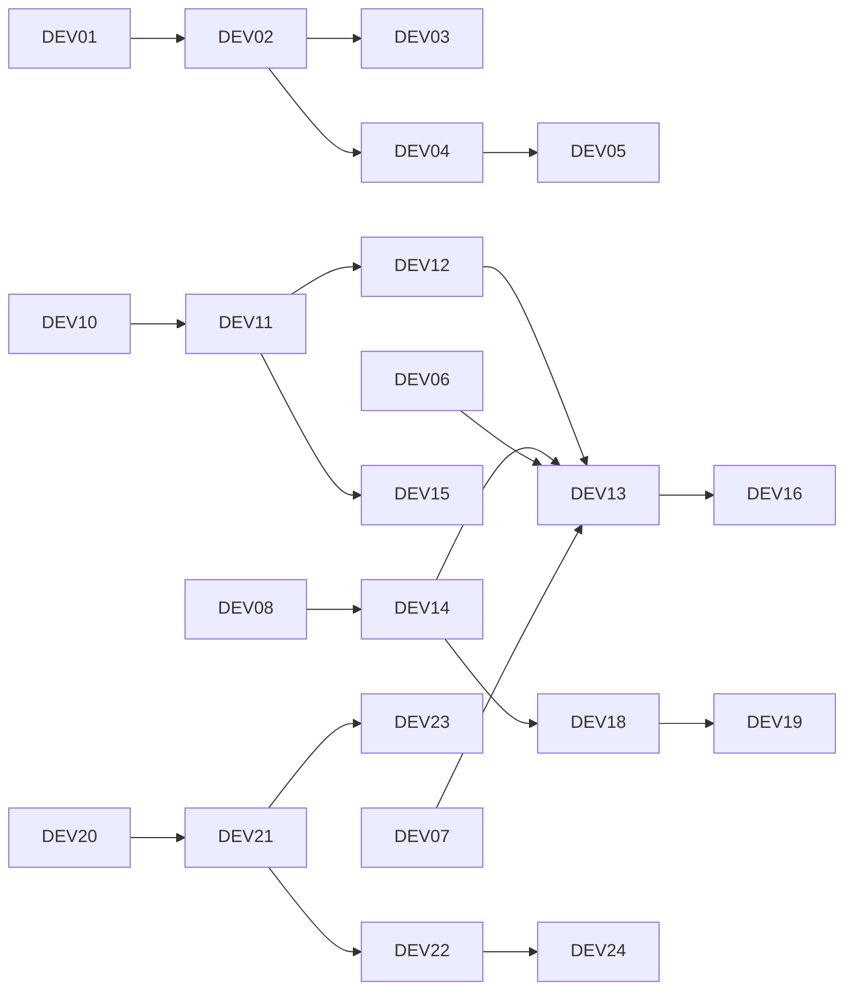

# Технический бэклог — Крепкая Охота

> Задача разработчика №5. **24 задачи**, разбитые по сложности. Оценка в
> story points (SP) по шкале Фибоначчи. Сложность: 🟢 простая (1–2 SP),
> 🟡 средняя (3–5 SP), 🔴 сложная (8–13 SP).
>
> ID задачи используется как имя feature-ветки (см. [CONTRIBUTING.md](../CONTRIBUTING.md)),
> столбец «Функция» ссылается на функциональные требования F1–F8.

---

## Сводка по сложности

| Сложность | Кол-во | Сумма SP |
|-----------|:---:|:---:|
| 🟢 Простая | 9 | 13 |
| 🟡 Средняя | 9 | 36 |
| 🔴 Сложная | 6 | 60 |
| **Итого** | **24** | **109** |

---

## 🟢 Простые задачи (1–2 SP)

| ID | Задача | Функция | SP |
|----|--------|:---:|:--:|
| DEV-01 | Инициализировать репозиторий: ветки `main`/`develop`, `.gitignore`, LICENSE | — | 1 |
| DEV-02 | Создать структуру каталогов (`frontend/`, `docs/`, `db/`, `backend/`) | — | 1 |
| DEV-03 | Написать README с инструкциями по запуску | — | 2 |
| DEV-04 | Свёрстать шапку и подвал сайта (навигация) | — | 1 |
| DEV-05 | Сделать страницы-заглушки (виды, избранное, о проекте) | — | 1 |
| DEV-06 | Переключатель режима «Охота/Рыбалка» (UI + состояние) | F2 | 2 |
| DEV-07 | Переключатель сезона (4 кнопки/селект) | F4 | 2 |
| DEV-08 | Подготовить демо-данные видов и сезонов (JSON) | — | 1 |
| DEV-09 | Базовая адаптивная вёрстка (моб./десктоп) | НФТ | 2 |

---

## 🟡 Средние задачи (3–5 SP)

| ID | Задача | Функция | SP |
|----|--------|:---:|:--:|
| DEV-10 | Подключить Leaflet, отрисовать карту Ростовской обл. | F1 | 3 |
| DEV-11 | Загрузить GeoJSON регионов и отрисовать полигоны угодий | F1 | 5 |
| DEV-12 | Клик по региону → выделение + открытие боковой панели | F1, F3 | 3 |
| DEV-13 | Карточка региона: список доступной дичи/рыбы по сезону | F3 | 5 |
| DEV-14 | Слой `api.js` — единая точка доступа к данным | — | 3 |
| DEV-15 | Поиск региона по названию с переходом на карте | F7 | 3 |
| DEV-16 | Карточка вида (фото, описание, сроки, ограничения) | F6 | 3 |
| DEV-17 | Обработка ошибок UI (нет данных, нет сети, пустой сезон) | НФТ | 5 |
| DEV-18 | Каталог видов с фильтром по режиму | F5 | 3 |

---

## 🔴 Сложные задачи (8–13 SP)

| ID | Задача | Функция | SP |
|----|--------|:---:|:--:|
| DEV-19 | Фильтр по виду: подсветка регионов, где он доступен | F5 | 8 |
| DEV-20 | Спроектировать и поднять БД PostgreSQL (этап 2) | — | 8 |
| DEV-21 | Реализовать REST API (Express) по контракту | — | 13 |
| DEV-22 | Перевести фронт с моков на реальный API (`api.js`) | — | 8 |
| DEV-23 | Авторизация (JWT) + избранные регионы | F8 | 13 |
| DEV-24 | CI/CD: деплой фронта на GitHub Pages, API на Render | — | 10 |

---

## Зависимости между задачами

---

## Граница MVP / прототипа

| Входит в прототип (день 2) | Этап 2 (после практики) |
|----------------------------|--------------------------|
| DEV-01 … DEV-18 (окружение, карта, режим, сезон, карточки, заглушки) | DEV-19 … DEV-24 (полный фильтр, БД, API, авторизация, CI/CD) |

> **Сделано в рамках дня 2 (этот PR):** DEV-01, DEV-02, DEV-03, DEV-04, DEV-05,
> DEV-06, DEV-07, DEV-08, DEV-10, DEV-11, DEV-12, DEV-13, DEV-14, DEV-15, DEV-16 —
> то есть запускаемый прототип с картой, навигацией, заглушками и основным
> сценарием «регион → доступные виды по сезону».
