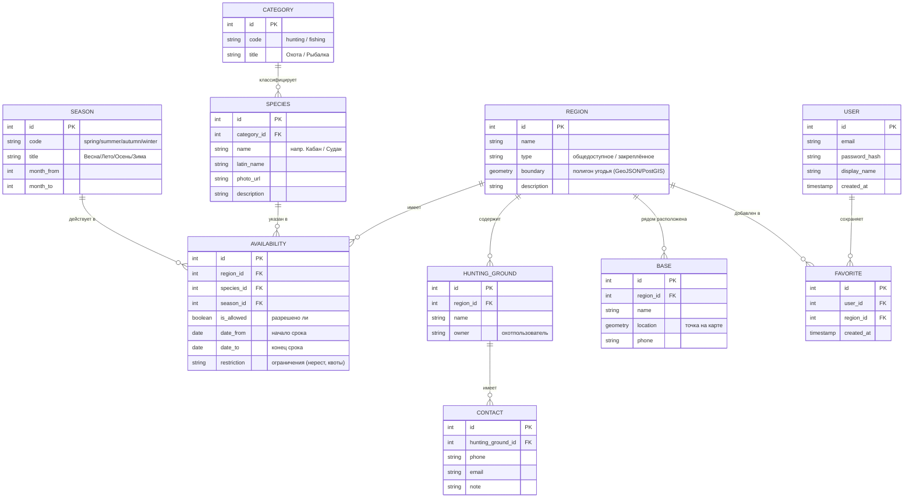

# Модель данных (ER) — Крепкая Охота

> Задача разработчика №3. Сущности, связи, атрибуты. ER-диаграмма в формате
> Mermaid. DDL — в [../db/schema.sql](../db/schema.sql), демо-данные — в
> [../db/seed.sql](../db/seed.sql).

---

## 1. ER-диаграмма

---

## 2. Сущности (словарь)

| Сущность | Назначение |
|----------|-----------|
| **REGION** (регион/угодье) | Территория Ростовской обл. с геометрией границ |
| **CATEGORY** (категория) | Режим: охота или рыбалка (F2) |
| **SPECIES** (вид) | Конкретная дичь или рыба (F6) |
| **SEASON** (сезон) | Времена года + диапазон месяцев (F4) |
| **AVAILABILITY** (доступность) | **Ядро модели**: что (species) где (region) когда (season) разрешено, с точными сроками и ограничениями (F3) |
| **HUNTING_GROUND** (охотхозяйство) | Хозяйство внутри региона (F8) |
| **CONTACT** (контакт) | Телефон/почта хозяйства (F8) |
| **BASE** (база отдыха) | База рядом с регионом, точка на карте (F8) |
| **USER** (пользователь) | Аккаунт для избранного |
| **FAVORITE** (избранное) | Сохранённые пользователем регионы |

---

## 3. Связи

| Связь | Тип | Смысл |
|-------|-----|-------|
| CATEGORY → SPECIES | 1 : N | У категории много видов; вид принадлежит одной категории |
| REGION → AVAILABILITY | 1 : N | В регионе много записей доступности |
| SPECIES → AVAILABILITY | 1 : N | Вид встречается во многих записях доступности |
| SEASON → AVAILABILITY | 1 : N | Сезон относится ко многим записям |
| REGION ↔ SPECIES | N : M | Реализовано через **AVAILABILITY** (+ сезон) |
| REGION → HUNTING_GROUND | 1 : N | В регионе несколько хозяйств |
| HUNTING_GROUND → CONTACT | 1 : N | У хозяйства несколько контактов |
| REGION → BASE | 1 : N | Рядом с регионом несколько баз |
| USER ↔ REGION | N : M | Через **FAVORITE** (избранные регионы) |

> **AVAILABILITY** — связующая таблица тройной связи «регион × вид × сезон».
> Именно она отвечает на главный вопрос сервиса: *что, где и когда можно добыть.*

---

## 4. Ключевые ограничения целостности

- `SPECIES.category_id` → `CATEGORY.id` (вид всегда принадлежит режиму).
- В `AVAILABILITY` уникальна тройка (`region_id`, `species_id`, `season_id`) —
  одна запись на сочетание.
- `date_from <= date_to` (проверка диапазона сроков).
- При удалении региона каскадно удаляются его `availability`, `hunting_ground`,
  `base`, `favorite` (`ON DELETE CASCADE`).
- `USER.email` — уникальный.
- Пара (`user_id`, `region_id`) в `FAVORITE` уникальна (нельзя добавить дважды).

---

## 5. Пример данных (что увидит пользователь)

| region | species | season | is_allowed | date_from | date_to | restriction |
|--------|---------|--------|:---:|------|------|-------------|
| Азовский р-н | Кабан | Осень | ✅ | 01.10 | 31.12 | по путёвке |
| Азовский р-н | Судак | Весна | ❌ | 01.04 | 31.05 | нерестовый запрет |
| Сальский р-н | Заяц-русак | Зима | ✅ | 01.11 | 15.01 | — |
| Цимлянский р-н | Сазан | Лето | ✅ | 16.06 | 31.08 | суточная норма |

Эти данные на MVP лежат в [../frontend/js/data.js](../frontend/js/data.js) и
[../frontend/assets/data/](../frontend/assets/data/), на этапе 2 — в таблицах БД.
